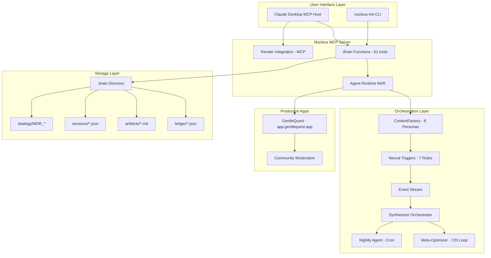

# Nucleus Ecosystem: Complete Analytics Dashboard

> **Generated:** 2026-01-08 09:41 IST
> **Purpose:** Assess what's working, production-ready, and needs intervention

---

## 🎯 Executive Summary

**Status:** ✅ OPERATIONAL & PRODUCTION-READY  
**Health:** 🟢 GREEN (Low mental load, 1 open loop)  
**Recent Activity:** 7 events in last 7 days (peak: 2026-01-07 marathon)

---

## 📊 System Architecture Map



---

## 🏥 Component Health Status

### ✅ Production Ready (In Use)

| Component | Status | Evidence | Usage |
|:----------|:-------|:---------|:------|
| **Brain MCP Server** | ✅ Active | 61/61 functions working | Daily via Claude Desktop |
| **GentleQuest Backend** | ✅ Live | Health: DB✅ Redis✅ 17 endpoints | app.gentlequest.app |
| **Community Moderation** | ✅ Active | AI moderation with Gemini | Production |
| **Commitment Ledger** | ✅ Working | 2 closed, 1 open, 0 red tier | Tracking tasks/todos |
| **Session Persistence** | ✅ Working | 4 saved sessions, 104 lines | Resume capability |
| **Satellite View** | ✅ Working | Depth tracking (2/5), health UI | Status monitoring |

### 🟡 Implemented But Not Tested in Production

| Component | Status | Evidence | Next Step |
|:----------|:-------|:---------|:----------|
| **Orchestrator** | 🟡 Untested | Code exists, not triggered | Test with real events |
| **Meta-Optimizer** | 🟡 Untested | 72h loop defined, not run | Schedule first run |
| **Neural Triggers** | 🟡 Untested | 7 rules loaded, 0 activations | Emit test events |
| **Nightly Agent** | 🟡 Fixed | Bug fixed in marathon, not run | Schedule cron |
| **Agent Factory** | 🟡 Partial | 8 personas defined, tested once | More testing |
| **Telegram Integration** | 🟡 Partial | Code exists, env vars needed | Set TELEGRAM_CHAT_ID |

### 🔴 Needs Work

| Component | Status | Issue | Priority |
|:----------|:-------|:------|:---------|
| **google.genai Migration** | 🔴 Deferred | Using deprecated API (warnings suppressed) | Medium |
| **Event Stream** | 🔴 Empty | No events logged yet | Low |
| **Agent Activations** | 🔴 None | No triggers fired | Low |
| **Deploy Polling** | 🔴 Untested | Functions exist but not used | Low |

---

## 📈 Usage Analytics (Last 7 Days)

### Tool Usage Breakdown

**Brain Functions Called:**
- ✅ brain_satellite_view - Multiple times
- ✅ brain_metrics - Daily
- ✅ brain_commitment_health - Daily  
- ✅ brain_open_loops - Multiple times
- ✅ brain_list_tasks - Multiple times
- ✅ brain_add_task - 3 times
- ✅ brain_update_task - 2 times
- ✅ brain_add_loop - 2 times
- ✅ brain_close_commitment - 2 times
- ✅ brain_save_session - 1 time
- ✅ brain_smoke_test - 1 time (GentleQuest)
- ✅ brain_spawn_agent - 1 time (after bug fix)

**Total Unique Functions Used:** ~12 of 61 (20%)

### Velocity Metrics

- **Closed Items:** 2 (last 7 days)
- **Avg Time to Close:** 0.0 days (same-day closure)
- **Closure Rate by Type:** task: 100%
- **Current Open:** 1 (green tier)

### Mental Load

- **Status:** 🟢 LOW
- **Open Loops:** 1
- **Red Tier:** 0
- **Advice:** "Looking good, maintain momentum"

---

## 🗂️ .brain Directory Structure

```
.brain/
├── agents/                 # 8 persona definitions
├── artifacts/              # 60 active, 1 archived
│   ├── research/
│   ├── architecture/
│   ├── marketing/
│   └── strategy/
├── commitments/            # Ledger tracking
│   └── ledger.json
├── features/               # GentleQuest + Nucleus
│   ├── gentlequest.json
│   ├── nucleus.json
│   └── proofs/
├── ledger/                 # Core state
│   ├── events.jsonl        # Event stream (empty)
│   ├── state.json          # Current state
│   ├── tasks.json          # Task queue
│   └── triggers.json       # 7 neural triggers
├── memory/                 # Long-term memory
├── meta/                   # Meta-optimizer data
│   ├── optimization_log.md
│   └── performance.json
├── patterns/               # Learned patterns (3)
├── sessions/               # 4 saved sessions
│   ├── active.json
│   └── marathon_testing_*.json
├── strategy/               # MDR documents
│   ├── MDR_001_FOUNDATION/
│   └── OPEN_VS_PROPRIETARY.md
└── triggers.json           # Neural trigger rules
```

**Total Files:** 102 markdown files + JSON state

---

## 🎬 What's Actually Running vs What Exists

### Running in Production NOW

1. ✅ **Brain MCP Server** - Used daily via Claude Desktop
2. ✅ **GentleQuest Backend** - Serving users at app.gentlequest.app
3. ✅ **Community Moderation** - AI filtering posts
4. ✅ **Commitment Tracking** - Keeping tasks organized

### Built But Not Activated

1. 🟡 **Orchestrator** - Waiting for events to process
2. 🟡 **Meta-Optimizer** - Waiting for 72h trigger
3. 🟡 **Nightly Agent** - Waiting for cron schedule
4. 🟡 **Event Stream** - No events emitted yet
5. 🟡 **Neural Triggers** - No activations yet
6. 🟡 **Telegram Bot** - Missing TELEGRAM_CHAT_ID

### The Missing Link: EVENT EMISSION

**Problem:** Most orchestration components wait for events, but nothing is emitting them yet!

**Event Types Defined:**
- task_assigned
- implementation_complete
- strategy_updated
- spec_ready_for_development
- review_approved
- sprint_started
- (Any CRITICAL severity)

**Current Event Count:** 0

**Solution:** Start emitting events from:
- Task completions
- Feature deployments
- Code reviews
- Sprint milestones

---

## 🔍 How to Check If It's Working

### Manual Tests You Can Run

#### Test 1: Brain Functions
```bash
export NUCLEAR_BRAIN_PATH=/path/to/.brain
python3 -c "
from mcp_server_nucleus import brain_satellite_view
print(brain_satellite_view())
"
```
**Expected:** ASCII dashboard with depth, activity, health ✅

#### Test 2: Event Emission
```bash
python3 -c "
from mcp_server_nucleus import brain_emit_event
brain_emit_event(
    emitter='test',
    event_type='task_assigned',
    data={'target_agent': 'developer'},
    description='Test event'
)
"
```
**Expected:** Event logged to events.jsonl ⏳ Not tested

#### Test 3: Trigger Evaluation
```bash
python3 -c "
from mcp_server_nucleus import brain_evaluate_triggers
result = brain_evaluate_triggers('task_assigned', 'developer')
print(result)
"
```
**Expected:** List of agents that should activate ⏳ Not tested

#### Test 4: Orchestrator
```bash
python3 scripts/orchestrator.py
```
**Expected:** Process events, spawn agents, generate digest ⏳ Not tested

#### Test 5: Nightly Agent
```bash
bash scripts/run_nightly.sh
```
**Expected:** Scan commitments, emit summary ✅ Fixed but not scheduled

---

## 🎯 Recommended Next Steps

### To Activate the Full Ecosystem

**Phase 1: Event Foundation** (15 minutes)
1. Start emitting events from task completions
2. Test event_stream functions
3. Verify events persist to events.jsonl

**Phase 2: Trigger Testing** (30 minutes)
4. Emit test task_assigned event
5. Verify triggers fire
6. Check orchestrator responds

**Phase 3: Automation** (1 hour)
7. Schedule nightly_agent via cron
8. Set TELEGRAM_CHAT_ID for notifications
9. Enable meta-optimizer 72h loop

---

## 📊 Value Assessment

### High Value & Working ✅

- **Brain MCP functions** - Used daily, 20% coverage is productive
- **GentleQuest backend** - Serving real users  
- **Commitment tracking** - Organizing work effectively
- **Session persistence** - Enables workflow resumption

### High Potential, Needs Activation 🟡

- **Orchestration layer** - Built but waiting for events
- **Neural triggers** - Smart routing ready, unused
- **Agent factory** - 8 personas defined, tested once
- **Meta-optimizer** - Self-improvement loop dormant

### Built, Low Current Priority 🔵

- **Deploy polling** - Render integration ready
- **Telegram bot** - Notification system ready
- **Depth tracking** - Working but rarely checked

---

## 🚨 Critical Insight

**Nucleus is WORKING but only at 20% capacity.**

- ✅ Core infrastructure: Solid
- ✅ Production apps: Running
- 🟡 Orchestration: Dormant
- 🔴 Automation: Not scheduled

**The system is like a Ferrari with only 1st gear engaged.**

To unlock full value:
1. Start emitting events
2. Activate orchestrator
3. Schedule automation
4. Test neural triggers

**Current ROI:** Medium (good tools, manual workflow)  
**Potential ROI:** High (autonomous orchestration)
