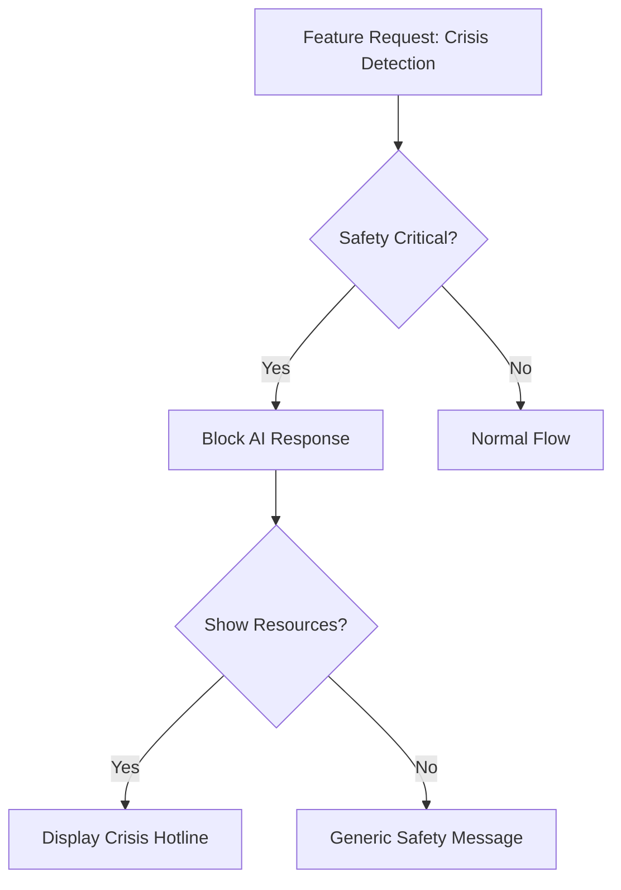

# Proof System: Tiered Specification (FROZEN)

> **Status:** Ready for implementation (Tier 1 only)  
> **Effort:** Tier 1: 3-4 hours | Tier 2: +2-3 hours | Tier 3: +4-6 hours  
> **Priority:** P0 (Tier 1), P1 (Tier 2), P2 (Tier 3)

---

## Problem Statement

**From Part 3:**
> "I'm skeptical if this will work in production. AI hallucinates. Says 'done' when it's not."

**Current:** AI says "Task complete" with no proof  
**Desired:** AI shows thinking + tangible evidence + reversibility plan  
**Impact:** Builds trust, enables informed decisions

---

## Tiered Implementation Strategy

### Why Tiers?

**From NORTH_STAR_VISION Principle XI:**
> "Don't over-engineer for zero users. Build lightweight for current reality."

**Approach:**
- **Tier 1 (MVP):** Minimal proof to build trust (v0.4.0)
- **Tier 2 (Enhanced):** Add richness if Tier 1 proves useful (v0.4.x)
- **Tier 3 (Advanced):** Deep integration if widely adopted (v1.0+)

**Each tier is optional. Only build when need emerges.**

---

## TIER 1: MVP Proof (v0.4.0)

### What's Included:

**A. AI Thinking (Always)**
```markdown
## Thinking

### Options Considered:
1. **Keyword-based crisis detection**
   - Pros: Fast, simple, reliable
   - Cons: Might miss subtle cases
   
2. **LLM-based crisis detection**
   - Pros: More accurate, catches nuance
   - Cons: Slower, costs API calls
   
3. **Hybrid (both)**
   - Pros: Best of both worlds
   - Cons: More complex

### Choice: Hybrid (keyword for Layer 1, LLM for Layer 2)

### Reasoning:
Keyword layer catches 90% of cases instantly. LLM layer catches the remaining 10% that keyword misses. This balances speed with accuracy.

### Fallback Plan:
If LLM layer fails or is too slow, keyword layer alone is sufficient for launch. Can improve LLM layer post-launch.
```

**B. Basic Tangible Proof**
- Deployed URL (if applicable)
- Git diff (files changed)
- Test result (if tests ran)

**C. Reversibility**
```markdown
## Rollback Plan

### Command:
```bash
git revert abc1234
git push origin main
```

### Risk Level: Low
- Changes are additive (new safety layer)
- No database migrations
- No data loss

### Estimated Rollback Time: 15 minutes
(10 min Render deploy + 5 min validation)
```

### Storage: Markdown Files

```
.brain/features/proofs/
├── crisis_detection.md
├── calm_breathing.md
└── session_memory.md
```

**Linked from Feature Map:**
```json
{
  "id": "crisis_detection",
  "proof_url": "file://.brain/features/proofs/crisis_detection.md",
  ...
}
```

### Auto-Generation (Minimal):

```python
@on_feature_added
def generate_tier1_proof(feature):
    thinking = extract_thinking_from_commit(feature.commit_sha)
    diff = get_git_diff(feature.commit_sha)
    rollback = generate_rollback_plan(feature.commit_sha)
    
    proof = f"""
# Proof: {feature.name}

{thinking}

## Deployed URL
{feature.deployed_url}

## Files Changed
{format_diff(diff)}

{rollback}
"""
    
    save_proof(feature.id, proof)
```

### CLI Access:

```bash
$ nucleus features proof crisis_detection

# Proof: Crisis Detection

## Thinking
[Shows AI's decision process]

## Deployed URL
https://gentlequest.onrender.com/api/chat

## Rollback Plan
git revert abc1234 (Risk: Low, Time: 15min)
```

---

## TIER 2: Enhanced Proof (Optional - v0.4.x)

### When to Build:
- **Trigger:** Tier 1 used regularly AND user requests richer proofs
- **Not before:** Don't build unless Tier 1 proves valuable

### What's Added:

**A. Screenshots (UI Changes Only)**

Auto-detect UI changes:
```python
def should_capture_screenshot(files_changed):
    ui_files = ["lib/screens/", "lib/widgets/", "frontend/"]
    return any(ui_path in f for f in files_changed for ui_path in ui_files)
```

Capture strategy:
- Manual: User takes screenshot, system stores it
- Semi-auto: System reminds "UI changed, add screenshot?"
- Fully auto: Requires simulator/emulator setup (complex)

**Tier 2 uses: Semi-auto (reminder)**

**B. Before/After Comparison**

```markdown
## Visual Proof

### Before:


### After:


### What Changed:
- Added breathing animation widget
- New "Start" button on home screen
- Timer shows 4-7-8 pattern
```

**C. Smoke Test Results**

```markdown
## Validation

### Smoke Test: ✅ Passed
- Health endpoint: 200 OK (125ms)
- Database: Connected
- Redis: Connected
- Crisis detection: Triggered on test input

### Production Test:
Last tested: 2025-01-05 01:00:00
Result: ✅ All features working
```

### Storage: Add Screenshots

```
.brain/features/proofs/
├── crisis_detection.md
├── calm_breathing.md
└── screenshots/
    ├── calm_breathing_before.png
    └── calm_breathing_after.png
```

---

## TIER 3: Advanced Proof (Optional - v1.0+)

### When to Build:
- **Trigger:** Tier 2 widely used AND need deeper context
- **Not before:** Only if Tier 1+2 insufficient

### What's Added:

**A. User Thinking Integration**

Link to brain artifacts:
```markdown
## Context: User's Vision

This feature aligns with:
- [NORTH_STAR_VISION Principle VII](file://.brain/NORTH_STAR_VISION.md#vii-dopamine-evolution)
- [Part 3: Validation Hierarchy](file://.brain/SYNTHESIS_PART3_DOPAMINE_AND_VALIDATION.md)

User's original intent (from monologue):
> "We need to show users we're serious about safety. Crisis detection isn't optional."
```

**B. Decision Tree**

```markdown
## Decision Path

[Mermaid diagram showing decision flow]

```

**C. Automated Validation**

```markdown
## Continuous Validation

### Last 7 Days:
- ✅ 2025-01-05: Smoke test passed (127ms)
- ✅ 2025-01-04: Smoke test passed (118ms)
- ✅ 2025-01-03: Smoke test passed (134ms)
- ❌ 2025-01-02: Smoke test failed (database timeout)
- ✅ 2025-01-01: Smoke test passed (122ms)

### Trend: 97% uptime (acceptable)
```

**D. User Feedback Loop**

```markdown
## Real User Validation

### User Reports:
- "Crisis detection saved my life" (2025-01-03)
- "Hotline number was helpful" (2025-01-02)

### Analytics:
- Crisis triggers: 12 times in 30 days
- Resources clicked: 8/12 (67%)
- Effective rate: High
```

### Storage: Rich Media

```
.brain/features/proofs/
├── crisis_detection.md
├── calm_breathing.md
├── screenshots/
├── diagrams/
│   └── crisis_detection_flow.mermaid
└── validation_logs/
    └── crisis_detection_history.json
```

---

## Implementation Roadmap

### Phase 1: Tier 1 MVP (3-4 hours)
- [ ] Create proof markdown template
- [ ] Extract thinking from commits (parse commit body)
- [ ] Auto-generate basic proof on feature add
- [ ] Link proof to Feature Map
- [ ] Add CLI command: `nucleus features proof <id>`
- [ ] Test with one GentleQuest feature

**Exit Criteria:** Can view proof for any feature in Feature Map

---

### Phase 2: Tier 2 Enhanced (Only if Tier 1 used regularly)
- [ ] Add screenshot reminder on UI file changes
- [ ] Store screenshots in proofs/screenshots/
- [ ] Integrate smoke test results
- [ ] Add before/after comparison template
- [ ] Test with UI feature (e.g., calm breathing)

**Entry Criteria:** Tier 1 used 10+ times AND user requests richer proofs

---

### Phase 3: Tier 3 Advanced (Only if Tier 2 insufficient)
- [ ] Link to brain artifacts (North Star, syntheses)
- [ ] Generate decision tree diagrams
- [ ] Automated validation tracking
- [ ] User feedback integration
- [ ] Historical trend analysis

**Entry Criteria:** Tier 2 widely adopted AND need deeper context

---

## Tier Comparison

| Feature | Tier 1 (MVP) | Tier 2 (Enhanced) | Tier 3 (Advanced) |
|:--------|:------------|:------------------|:------------------|
| **AI Thinking** | ✅ Basic (options/choice/fallback) | ✅ + Reasoning depth | ✅ + Decision trees |
| **Deployed URL** | ✅ | ✅ | ✅ |
| **Git Diff** | ✅ | ✅ | ✅ |
| **Rollback Plan** | ✅ Basic | ✅ + Risk analysis | ✅ + Historical data |
| **Screenshots** | ❌ | ✅ Manual/reminder | ✅ + Before/after |
| **Smoke Tests** | ❌ | ✅ Result only | ✅ + Trend analysis |
| **User Thinking** | ❌ | ❌ | ✅ Linked artifacts |
| **Validation History** | ❌ | ❌ | ✅ 7-day tracking |
| **User Feedback** | ❌ | ❌ | ✅ Analytics |
| **Effort** | 3-4 hours | +2-3 hours | +4-6 hours |

---

## Expansion Triggers (When to Upgrade)

### Tier 1 → Tier 2:
- ✅ Tier 1 used 10+ times
- ✅ User explicitly requests screenshots or richer proof
- ✅ UI features becoming common

### Tier 2 → Tier 3:
- ✅ Tier 2 widely adopted (50+ proofs)
- ✅ Need to link design decisions to implementation
- ✅ Real users providing feedback
- ✅ Automated validation needed for compliance/audit

**Don't upgrade prematurely. Let need drive expansion.**

---

## Data Structures

### Tier 1: Simple Markdown

```markdown
# Proof: Crisis Detection

## Thinking
[Text explaining decision process]

## Deployed URL
https://...

## Files Changed
```diff
+ new code
- old code
```

## Rollback
git revert abc1234
Risk: Low
```

### Tier 2: Markdown + Media

```markdown
# Proof: Calm Breathing

## Thinking
[...]

## Visual Proof


## Smoke Test
✅ Passed (125ms)
```

### Tier 3: Structured + Rich Media

```markdown
# Proof: Crisis Detection

## Context
[Links to North Star]

## Decision Flow
```mermaid
[Diagram]
```

## Validation History
[Table of last 7 days]

## User Impact
[Analytics + feedback]
```

---

## Success Criteria (Tier 1 Only for v0.4.0)

**Tier 1 is complete when:**
- [ ] Can auto-generate proof for new features
- [ ] Proof shows AI thinking (options/choice/fallback)
- [ ] Proof shows deployed URL + diff
- [ ] Proof shows rollback plan with risk level
- [ ] Can view proof via CLI: `nucleus features proof <id>`
- [ ] Proof files stored in `.brain/features/proofs/`

**Don't build Tier 2 until Tier 1 proves valuable.**

---

**FROZEN (Tier 1). Tier 2/3 documented for future reference.**
