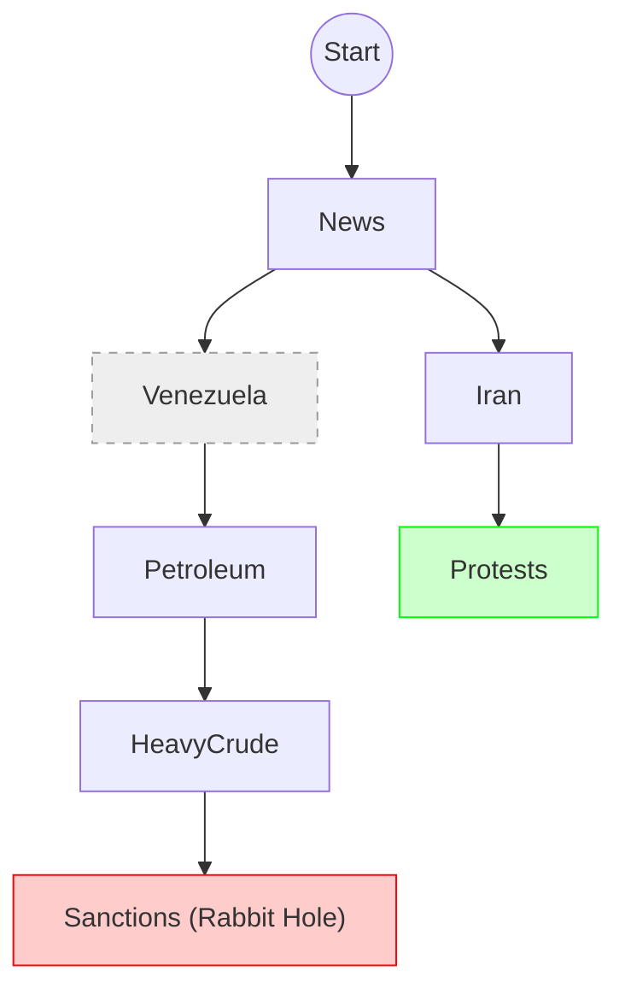

# Vision: The Exploration Map (Depth Tracker Tier 2)

> **The Insight:** Currently, we are using a **Flashlight**. We need a **Cartographer**.

## The Critique: "The Amnesiac Explorer"

In the current Tier 1 implementation (Stack-based), when you `pop` up from a topic (e.g., leaving "Venezuela" to go to "Iran"), the "Venezuela" branch is **deleted** from the session state.

**The Consequence:**
- You lose the context of *where you have been*.
- You cannot see the "shape" of your research session.
- You cannot easy "fast travel" back to a previous deep dive.

## The Revelation: "Strategy Game Fog of War"

Imagine playing *Civilization* or *Age of Empires*. When you move your scout, the "Fog of War" clears. Even when you leave that area, the map remains visible (though not updated). PROOF of exploration remains.

We need to treat **Conversation** like **Map Exploration**.

## Proposed Solution: The Persistent Tree

Instead of a **Stack** (LIFO - Last In, First Out), we use a **Tree** with a "Current Pointer".

### Data Structure Shift

**Current (Stack):**
```json
[Root, News, Venezuela, Petroleum]
// When popping, 'Petroleum' is simply deleted.
```

**Proposed (Tree):**
```json
{
  "nodes": {
    "1": {"id": "1", "parent": "root", "topic": "News"},
    "2": {"id": "2", "parent": "1", "topic": "Venezuela"},
    "3": {"id": "3", "parent": "2", "topic": "Petroleum"},
    "4": {"id": "4", "parent": "1", "topic": "Iran"} // Sibling of Venezuela
  },
  "current_node_id": "4",
  "visited_path": ["root", "1", "4"]
}
```

## The Visualization (Mermaid)

With this structure, we can generate a **Strategy Map** of your session:



## Features Enabled

1.  **The "Tech Tree" View:** See your conversation branching out.
2.  **Fast Travel:** `nucleus depth jump [node_id]` (Instantly restore context).
3.  **Completionism:** "I've explored 3/5 branches of this problem."
4.  **Save/Load Maps:** "Here is my research map on Venezuela."

## Implementation

- **Difficulty:** Medium.
- **Requirement:** Migrating `_depth_push` / `_depth_pop` logic from `list.append()` to `tree.insert()`.
- **Value:** High. Transforms "Depth Safety" into "Knowledge Architecture".
