# Nucleus Internal Architecture Sketch

> **Internal sketch - not a public artifact**
> WORKING SKETCH

```mermaid
flowchart LR
    subgraph Clients["Agents / MCP Clients"]
        A1[Claude Desktop]
        A2[Windsurf]
        A3[Cursor]
    end

    subgraph Ingress["MCP Ingress"]
        MCP[MCP Protocol]
    end

    subgraph Nucleus["Nucleus MCP Server"]
        direction TB
        AUTH["Auth & Session Guard (MCP)"]
        ROUTER["Task Router"]
        DAG["Execution Graph (DAG)"]
        ORCH["Orchestration Primitives<br/>(queue, retry, timeout)"]
        STATE["State Store (minimal)<br/>.brain/ledger/"]
        
        AUTH --> ROUTER
        ROUTER --> DAG
        DAG --> ORCH
        ORCH --> STATE
    end

    subgraph Adapters["Tool Bridge"]
        HTTP["HTTP Adapter"]
        CLI["CLI Adapter"]
        PY["Python Adapter"]
    end

    subgraph Workers["Workers / Runtimes"]
        W1["Python Scripts"]
        W2["External APIs"]
        W3["Shell Commands"]
    end

    subgraph Observability["Observability (optional)"]
        LOGS["Logs/Events"]
    end

    Clients --> MCP
    MCP --> AUTH
    ORCH --> Adapters
    Adapters --> Workers
    STATE -.-> LOGS
```

---

## Non-Functional Notes

| Constraint | Status |
|:-----------|:-------|
| No customer data | ✅ |
| No employer infra | ✅ |
| After-hours OSS | ✅ |

---

## Component Summary

| Component | Purpose |
|:----------|:--------|
| **MCP Ingress** | Standard MCP protocol handler |
| **Auth & Session Guard** | Validates MCP connections |
| **Task Router** | Routes tasks by priority/skill |
| **Execution Graph (DAG)** | Manages task dependencies |
| **Orchestration Primitives** | Queue, retry, timeout logic |
| **State Store** | Minimal persistence (.brain/) |
| **Tool Bridge** | Adapters for HTTP/CLI/Python |
| **Workers** | Actual execution runtimes |
| **Observability** | Optional logging hooks |

---

*Internal sketch - not a public artifact*
