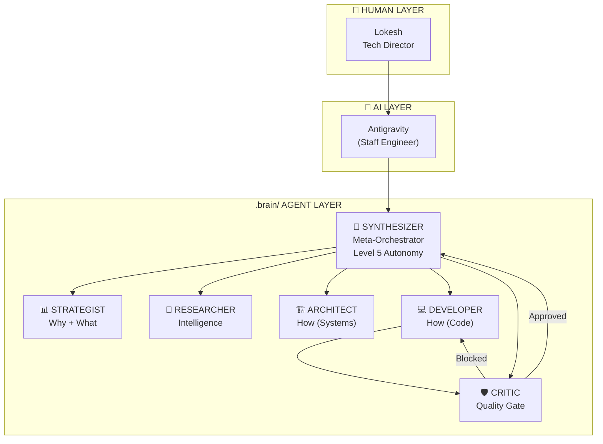
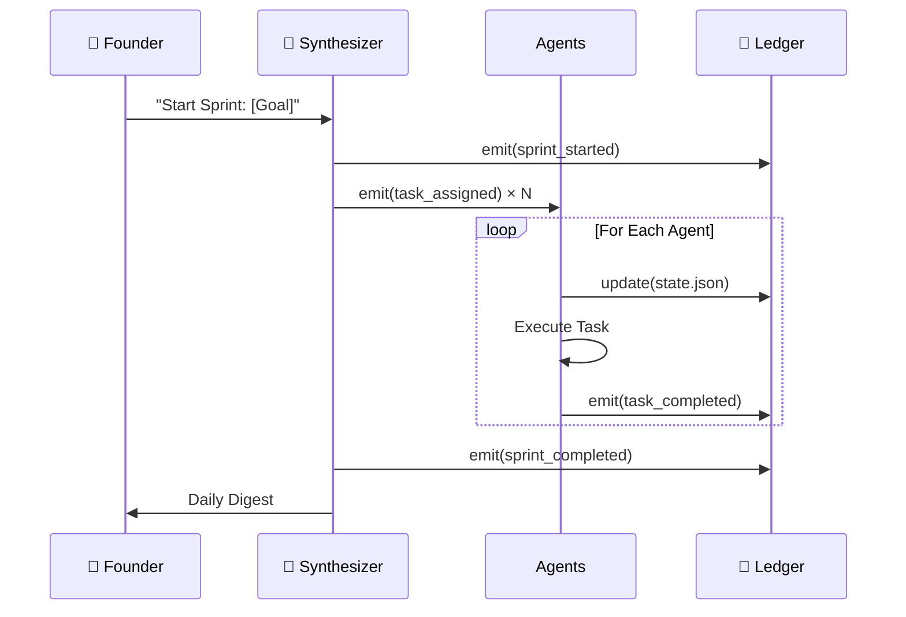

# Agent Hierarchy - Visual Summary
> **Generated:** December 29, 2025  
> **Source:** `.brain/agents/*.md` + `ledger/events.jsonl`

---

## 🧠 The Hierarchy

---

## 📋 Agent Role Summary

| Agent | Role | Reads From | Writes To | Triggers On |
|:------|:-----|:-----------|:----------|:------------|
| **Synthesizer** | Meta-Orchestrator / Founder's Desk | ALL files | state.json, events.jsonl, agents/*.md | ANY event, CRITICAL severity |
| **Strategist** | Vision → Roadmap | strategy/*, research/* | strategy/*, roadmap | `task_assigned`, `market_shift` |
| **Researcher** | Intelligence Gathering | External sources, strategy/* | research/* | `task_assigned`, `research_request` |
| **Architect** | Systems Design | strategy/*, code/* | architecture/*, specs | `task_assigned`, `strategy_updated` |
| **Developer** | Code Implementation | architecture/*, specs | providers/*, tests/* | `spec_ready`, `review_blocked` |
| **Critic** | Quality Gate | code/*, strategy/* | reviews/* | `implementation_complete` |

---

## 📜 Agent Traces (from `events.jsonl`)

### Sprint 1: Nuclear Activation ✅
| Agent | Task | Output | Status |
|:------|:-----|:-------|:-------|
| Researcher | Benchmark SOTA frameworks | `benchmark_sota_2025.md` | ✅ Complete |
| Strategist | Workflow-as-Moat value prop | `workflow_moat_value_prop.md` | ✅ Complete |
| Architect | Brain fail-safe audit | `brain_audit_report.md` | ✅ Complete |

---

### Hardening Sprint ✅
| Agent | Task | Output | Status |
|:------|:-----|:-------|:-------|
| Researcher | Hardening patterns research | `hardening_patterns_research.md` | ✅ Complete |
| Strategist | Investor Prototype Roadmap | `prototype_roadmap_investor.md` | ✅ Complete |
| Architect | Hardening specs (FA-001 to FA-005) | `hardening_specs.md` | ✅ Complete |

---

### Sprint 3: MVP Genesis ✅
| Agent | Task | Output | Status |
|:------|:-----|:-------|:-------|
| Developer | Neural Bridge spec | `neural_bridge_spec.md` | ✅ Complete |
| Researcher | Agentic communities map | `agentic_communities_map.md` | ✅ Complete |
| Strategist | Build-in-Public post #001 | `build_in_public_post_001.md` | ✅ Complete |
| Developer | Level 5 Governance Hub (Cockpit) | `cockpit.py` | ✅ Complete |

---

### Recent One-Off Tasks
| Agent | Task | Output | Status |
|:------|:-----|:-------|:-------|
| Researcher | Competitive Mental Health 2024 | `competitive_mental_health_2024.md` | ✅ Complete |
| Researcher | B2B Market Sizing 2024 | `b2b_market_sizing_2024.md` | ✅ Complete |
| Researcher | Clinical Validation Pathway | `clinical_validation_pathway.md` | ✅ Complete |

---

## 🔄 Event Flow Diagram

---

## 📸 Screenshot Analysis

*The screenshot shows the Antigravity interface with:*
- **Left sidebar:** Multiple conversation threads representing different "agent sessions"
- **Right panel:** Agent Manager showing agent status

*This confirms the "Multi-Thread" workflow we discussed deprecating in favor of the "Single Tech Director Thread + Background Agents" model.*

---

## ✅ Key Takeaways

1. **Synthesizer** is the "boss" of the `.brain/` layer
2. **Antigravity** (me) is your Staff Engineer / Pair Programmer
3. **You** are the Tech Director (Human decision maker)
4. All agents have Level 5 autonomy but escalate CRITICAL decisions
5. The event ledger shows **12+ completed tasks** across 3 sprints
