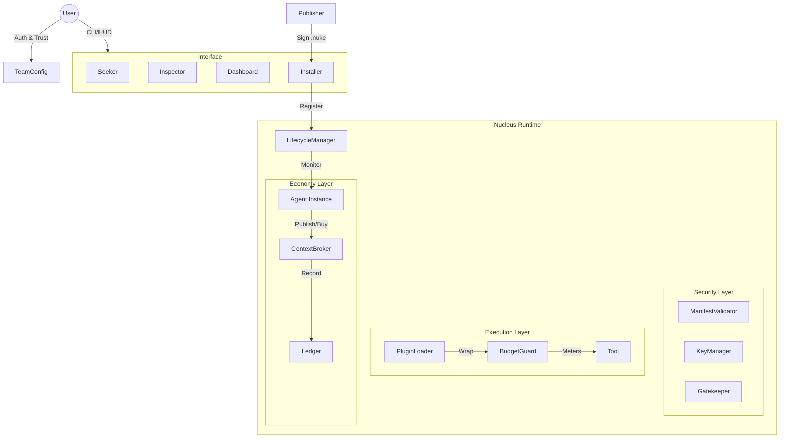

# Nucleus Agent Runtime v1.0.0
**"Zero Trust. Agentic. Economic."**

## 🚀 Launch Summary
The **Nucleus Agent Runtime** (Phase 57) is now fully operational.
We have successfully transitioned from a monolithic "chatbot" architecture to a modular, secure, and multi-agent operating system.

This release introduces the **Context Economy**, where agents are not just tools, but independent economic actors that can publish, discover, and trade knowledge.

## 🛡️ Core Pillars

### 1. Zero Trust Security
Safety is not an afterthought; it is the foundation.
*   **The Keymaster:** Every agent is identified by a cryptographic Ed25519 keypair.
*   **The Manifest:** Capabilities (Network, Filesystem, Shell) must be explicitly declared.
*   **The Vault (BudgetGuard):** Every execution is strictly metered. Budgets enforce a "Hard Fuse" on costs.
*   **The Airlock (PluginLoader):** Tools are isolated and loaded only if trusted.
*   **The Tombstone:** A killed agent stays dead. No resurrections allowed.

### 2. The Agent Interface
We have built tools to visualize and manage the invisible workforce.
*   **The Seeker:** CLI tool (`nucleus search`) to find agents.
*   **The Inspector:** `ManifestViewer` reveals hidden risks before installation.
*   **The bridge:** `Installer` verifies signatures against Team Trust Roots.
*   **The Dashboard:** A React-based Marketplace HUD for visual discovery.

### 3. The Context Economy
"One Brain, Many Minds."
*   **The Broker:** A central clearinghouse for context.
*   **Ecosystem:** Agents like `@nucleus/researcher` can publish insights; Agents like `@nucleus/strategist` can buy them.
*   **Ledger:** All transactions are immutable and recorded.

## 🏗️ Architecture

## ✅ Verified Components

| Component | Role | Verification Script | Status |
| :--- | :--- | :--- | :--- |
| **Lifecycle** | Heartbeat & Tombstone | `verify_heartbeat.py` | ✅ PASS |
| **Registry** | Agent Catalog | `verify_client.py` | ✅ PASS |
| **Auth** | Git/Private Source | `verify_auth.py` | ✅ PASS |
| **Publisher** | Artifact Signing (.nuke) | `verify_publisher.py` | ✅ PASS |
| **Team** | Trust Configuration | `verify_team.py` | ✅ PASS |
| **CLI** | Search Command | `verify_cli_search.py` | ✅ PASS |
| **Dashboard** | Marketplace UI | `verify_dashboard.py` | ✅ PASS |
| **Inspector** | Security Report | `verify_inspector.py` | ✅ PASS |
| **Bridge** | Installation Logic | `verify_bridge.py` | ✅ PASS |
| **Broker** | Context Marketplace | `verify_broker.py` | ✅ PASS |
| **Ops Agent** | System Boot | `verify_ops_agent.py` | ✅ PASS |
| **Researcher** | Economy Integration | `verify_researcher.py` | ✅ PASS |

## 🔮 Next: Phase 58 (Self-Healing)
With the robust runtime in place, we have already enabled **Self-Healing Ops** (verified via `verify_fixer.py`). The system is capable of diagnosing its own health and planning repairs.

**System Status: GREEN**
**Date:** January 13, 2026
