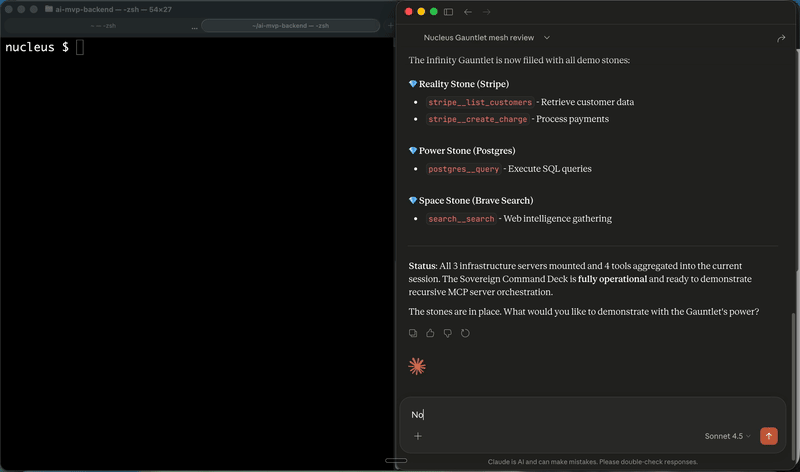

# 🧠 Nucleus MCP

<!-- GLAMA_BADGE:START -->
[](https://glama.ai/mcp/servers/@eidetic-works/nucleus-mcp)
<!-- GLAMA_BADGE:END -->
<!-- PULSEMCP_BADGE:START -->
[](https://www.pulsemcp.com/servers/eidetic-works-nucleus)
<!-- PULSEMCP_BADGE:END -->

[](https://pypi.org/project/nucleus-mcp/)
[](https://opensource.org/licenses/MIT)
[](https://modelcontextprotocol.io)
[](https://www.python.org/downloads/)

> [!CAUTION]
> **After the [OpenClaw security crisis](https://www.youtube.com/watch?v=ceEUO_i7aW4) (1.5M API keys leaked, sleeper agents in skills), agent security is no longer optional.**
> Nucleus was built security-first: Hypervisor controls, resource locking, and full audit trails — all 100% local.

> **The Universal Brain for AI Agents** — One brain that syncs Cursor, Claude Desktop, Windsurf, and any MCP-compatible tool.

---

## 🎯 The Problem

You use **multiple AI tools** daily:
- **Cursor** for coding
- **Claude Desktop** for thinking
- **Windsurf** for exploration
- **ChatGPT** for quick reasoning

**But they don't share memory. (Until now).**

Every time you switch tools, you lose context. You re-explain decisions. You repeat yourself constantly.

---

### ✨ The Solution

**Nucleus syncs them with one brain.**

```
Tell Claude about a decision → Cursor knows it
Make a plan in Windsurf → Claude remembers it
One brain. All your tools.
```



> [!TIP]
> **See the "Recursive Snap" in action**: Nucleus mounts your entire tool mesh (Stripe, Search, Postgres) into a single governed parent instantly.

---

## 🚀 What Makes Nucleus Different

| Feature | Other Solutions | Nucleus |
|---------|-----------------|---------|
| **Cross-Platform Sync** | Single platform only | ✅ Syncs ALL your AI tools |
| **Sovereignty** | Cloud-dependent | ✅ 100% local, your data stays on your machine |
| **Protocol** | Proprietary | ✅ MCP standard (Anthropic-backed) |
| **Security** | Often misconfigured | ✅ Secure by default, audit logs included |
| **Lock-in** | Platform-specific | ✅ MIT license, open standard |

---

## ⚡ Quick Start (2 Minutes)

### 1. Install

```bash
pip install nucleus-mcp
```

### 2. Initialize

```bash
nucleus-init --scan
```

This creates your `.brain/` folder, auto-configures Claude Desktop, and **automatically ingests your README.md** to seed the brain with initial context.

### 3. Restart Claude Desktop

Then try:
> "What decisions have we made about the architecture?"

Claude will now remember across sessions!

---

## 🔧 Manual Configuration

### Claude Desktop

Add to `~/Library/Application Support/Claude/claude_desktop_config.json` (macOS):

```json
{
  "mcpServers": {
    "nucleus": {
      "command": "python3",
      "args": ["-m", "mcp_server_nucleus"],
      "env": {
        "NUCLEAR_BRAIN_PATH": "/path/to/your/project/.brain"
      }
    }
  }
}
```

### Cursor

Add to `~/.cursor/mcp.json`:

```json
{
  "mcpServers": {
    "nucleus": {
      "command": "python3",
      "args": ["-m", "mcp_server_nucleus"],
      "env": {
        "NUCLEAR_BRAIN_PATH": "/path/to/your/project/.brain"
      }
    }
  }
}
```

### Windsurf

Add to `~/.codeium/windsurf/mcp_config.json`:

```json
{
  "mcpServers": {
    "nucleus": {
      "command": "python3",
      "args": ["-m", "mcp_server_nucleus"],
      "env": {
        "NUCLEAR_BRAIN_PATH": "/path/to/your/project/.brain"
      }
    }
  }
}
```

### ChatGPT (Web)

1. Go to **Settings** → **Apps** → **Advanced** → **Developer Mode**.
2. Run the Nucleus SSE Bridge: `python scripts/sse_bridge.py`.
3. Add `http://localhost:8000/sse` as your MCP endpoint.

See the [Community FAQ](docs/COMMUNITY_FAQ.md) for more details.

---

## 🛠 Core Tools

### Memory
| Tool | Description |
|------|-------------|
| `brain_write_engram` | Store persistent knowledge |
| `brain_query_engrams` | Retrieve knowledge |
| `brain_audit_log` | View decision history |

### Sync (Multi-Agent)
| Tool | Description |
|------|-------------|
| `brain_sync_now` | Manually trigger brain sync |
| `brain_sync_status` | Check sync state and conflicts |
| `brain_sync_auto` | Enable/disable auto-sync |
| `brain_identify_agent` | Register agent identity |

### State Management
| Tool | Description |
|------|-------------|
| `brain_get_state` | Get current project state |
| `brain_set_state` | Update project state |
| `brain_list_artifacts` | List all artifacts |

### Hypervisor (Security)
| Tool | Description |
|------|-------------|
| `lock_resource` | Lock file/folder (immutable) |
| `unlock_resource` | Unlock resource |
| `watch_resource` | Monitor file changes |
| `hypervisor_status` | View security state |

---

## 🔄 Multi-Agent Sync (The Killer Feature)

**Multiple agents, one brain.**

```python
# Agent A (Claude Desktop) makes a decision
brain_sync_now()  # Syncs to shared .brain/

# Agent B (Cursor) automatically sees it
brain_sync_status()  # Shows last sync, active agents
```

**Features:**
- **Intent-Aware Locking** — Files locked with WHO/WHEN/WHY metadata
- **Conflict Detection** — Last-write-wins with manual resolution option
- **Auto-Sync** — Optional file watcher for real-time sync
- **Audit Trail** — Every sync logged to `events.jsonl`

---

## ⚔️ Comparison: Nucleus vs Alternatives

| | OpenClaw | Claude Code | Nucleus |
|---|----------|-------------|---------|
| **What it syncs** | OpenClaw → OpenClaw | Claude → Claude | **Everything ↔ Everything** |
| **Security** | ❌ Sleeper agents, key leaks | ⚠️ Cloud-managed | ✅ Hypervisor + audit trail |
| **Cross-platform** | ❌ | ❌ | ✅ |
| **Local-first** | ⚠️ Some cloud | ⚠️ Some cloud | ✅ 100% local |
| **Identity Persistence** | ❌ Session-bound | ❌ Login-bound | ✅ Hypervisor-enforced |
| **MCP Native** | ❌ Custom protocol | ⚠️ Limited | ✅ Full MCP |
| **Open Source** | ✅ MIT | ❌ Closed | ✅ MIT |

---

## 🔗 Technical Deep Dives

*   **Forensics**: [How we trace agent intent at the kernel level](https://dev.to/nucleusos/how-i-synced-cursor-claude-and-windsurf-with-one-shared-brain-mcp-1mh4)
*   **Philosophy**: [Why we abandoned cloud memory for local sovereignty](https://dev.to/nucleusos/why-we-abandoned-cloud-memory-for-local-sovereignty-5bbo)

**OpenClaw is great for multi-agent teams on their platform.**
**OpenClaw trades security for capability. Nucleus gives you both.**

> [!TIP]
> **Check out the [Detailed Comparison](COMPARISON.md)** to see how Nucleus stacks up against ContextStream and Autonomy AI.

---

## 📁 The `.brain/` Folder

Nucleus stores everything in a `.brain/` folder in your project:

```
.brain/
├── config/
│   └── nucleus.yaml      # Configuration
├── ledger/
│   ├── state.json        # Current state
│   ├── events.jsonl      # Audit log
│   └── decisions.md      # Decision history
├── artifacts/
│   └── ...               # Your stored knowledge
└── sessions/
    └── ...               # Saved sessions
```

**Your data. Your machine. Your control.**

---

## 🤝 Contributing

We're building the universal brain for AI agents. Join us!

- **🐛 Found a bug?** Open an [Issue](https://github.com/eidetic-works/nucleus-mcp/issues)
- **💡 Feature idea?** Start a [Discussion](https://github.com/eidetic-works/nucleus-mcp/discussions)
- **🔧 Want to contribute?** See [CONTRIBUTING.md](CONTRIBUTING.md)

### ✨ Pioneers & Contributors

Nucleus is a community-first project. A special thank you to our first contributor for setting the standard:

- **[@aryasadawrate19](https://github.com/aryasadawrate19)** — Added Linux XDG support for `nucleus-init`, bringing Nucleus to the Linux ecosystem.

*Want to be here? See [CONTRIBUTING.md](CONTRIBUTING.md) and claim a "Good First Issue".*

### Development Setup

```bash
git clone https://github.com/eidetic-works/nucleus-mcp.git
cd nucleus-mcp
python3 -m venv venv
source venv/bin/activate
pip install -e ".[dev]"
pytest tests/
```

## 🛡️ Join the Nucleus Vanguard (Private Beta)

We're building the first secure sync layer for agents. Join our Vanguard Pioneers to help shape the roadmap and get early access to features before they go public.

**[Join the Nucleus Vanguard (Discord)](https://discord.gg/RJuBNNJ5MT)** | **[Visit Website](https://nucleusos.dev)**

> [!TIP]
> The Vanguard is currently open for early adopters. Introduce yourself in the `#welcome-start` channel to claim your **Vanguard Pioneer** role and join the inner circle.

---

## 📜 License

MIT © Nucleus Team

---

## ⭐ Support

**Star us on GitHub if Nucleus saves you from context amnesia!**

One brain. All your AI tools. No more repeating yourself.

---

*Built for the AI-native developer.*
