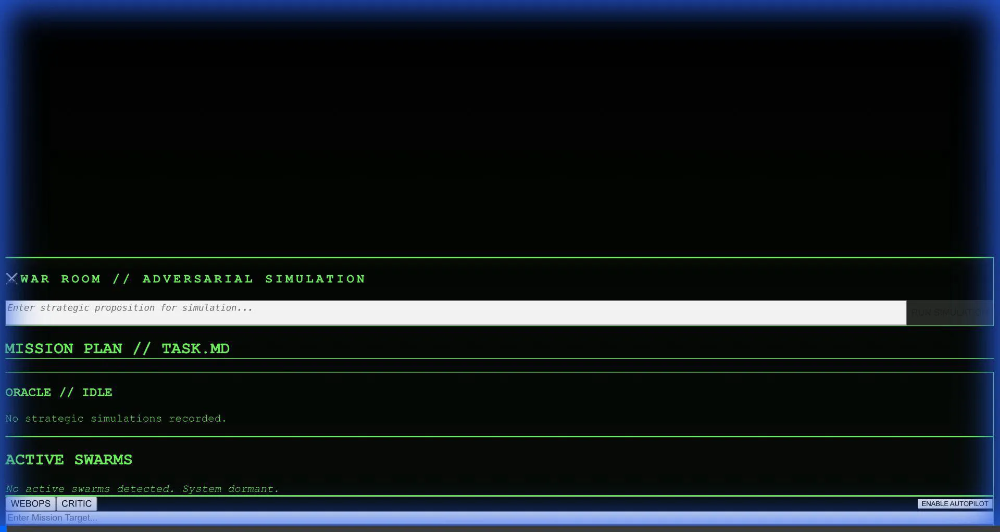
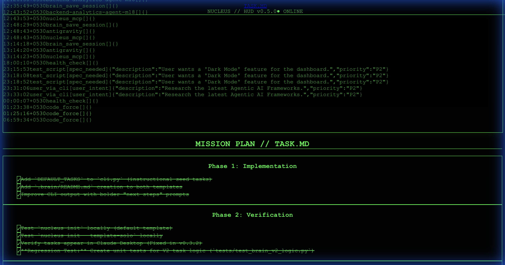

# Building the Nucleus Sovereign Container: A Cloud Run Journey

> **Author:** Lokesh Garg  
> **Date:** January 14, 2026  
> **Tags:** Cloud Run, Docker, Next.js, Python, Supervisord, GCP

---

## The Challenge

Deploying a **unified container** that runs both a Next.js frontend and a Python MCP backend on Google Cloud Run. The goal: a single "Sovereign Container" that hosts the entire Nucleus brain.

---

## The Architecture

```
┌─────────────────────────────────────────┐
│         Nucleus Sovereign Container      │
│                                          │
│  ┌─────────────────┐  ┌───────────────┐ │
│  │   Next.js HUD   │  │ Python/Nucleus│ │
│  │   (Port 8080)   │  │  (Port 8000)  │ │
│  └────────┬────────┘  └───────┬───────┘ │
│           │                   │          │
│           └───────┬───────────┘          │
│                   │                      │
│         ┌─────────▼─────────┐            │
│         │   supervisord     │            │
│         └───────────────────┘            │
└─────────────────────────────────────────┘
```

---

## The Journey

### Part 1: Initial Deployment Attempt

First, we built the unified Dockerfile. Here's the Cloud Run E2E test in action:



**What happened:** The container started but Cloud Run couldn't reach it. The health check failed.

---

### Part 2: Debugging the Port Binding

The root cause: Next.js was binding to `localhost` instead of `0.0.0.0`. Cloud Run's load balancer probes from outside the container, so `localhost` binding means it can't connect.

**The Fix:**
```ini
# deploy/supervisord.conf
[program:hud]
command=/bin/bash -c "npm start -- -p ${PORT:-8080} -H 0.0.0.0"
```

Here's the HUD login screen after the fix:


---

### Part 3: The GCS Volume Mount Trap

Even after fixing the port, the container kept crashing. The logs revealed:

```
gcsfuse: bucket "gentlequest-brain" not found
```

The bucket didn't exist! And worse, Cloud Run's volume configuration was cached from a previous deployment attempt.

**The Fix:**
```yaml
# deploy/cloudbuild.yaml
args:
  - '--clear-volumes'       # Force reset
  - '--clear-volume-mounts' # Clear all mounts
  - '--add-volume'
  - 'name=brain-storage,type=cloud-storage,bucket=gentlequest-brain'
```

Then created the bucket:
```bash
gsutil mb -l us-central1 gs://gentlequest-brain
```

---

### Part 4: Success! 🎉

After all the fixes, the HUD came online:



**Verification Results:**
- **URL:** https://nucleus-sovereign-7an2ps6yna-uc.a.run.app
- **Status:** 🟢 Live & Healthy
- **Latency:** ~432ms (cold start)
- **Auth:** Basic Auth active (`admin:nucleus`)

---

## Key Learnings

1. **Always bind to `0.0.0.0`** in containerized apps. Cloud Run, Kubernetes, and most orchestrators probe from outside the container.

2. **Volume configs are sticky.** Use `--clear-volumes` when debugging mount issues on Cloud Run.

3. **Unified containers work.** Running Next.js + Python under supervisord in a single container simplifies deployment while maintaining separation of concerns.

---

## What's Next

- Custom domain mapping (`sovereign.gentlequest.ai`)
- Persistent storage optimization
- Security hardening (moving beyond `--allow-unauthenticated`)

---

*This walkthrough was generated during a live development session. All recordings were captured in real-time using Antigravity's browser recording tools.*

---
## Provenance
- **Session ID:** `7c654df4-b83e-43f9-8620-f15868ec39d1`
- **Date Generated:** 2026-01-14
- **Tool:** Gemini Code Assist (Antigravity) + Nucleus MCP Server
- **Verification:** `/oracle-audit` passed on 2026-01-14
