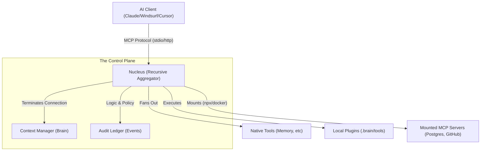
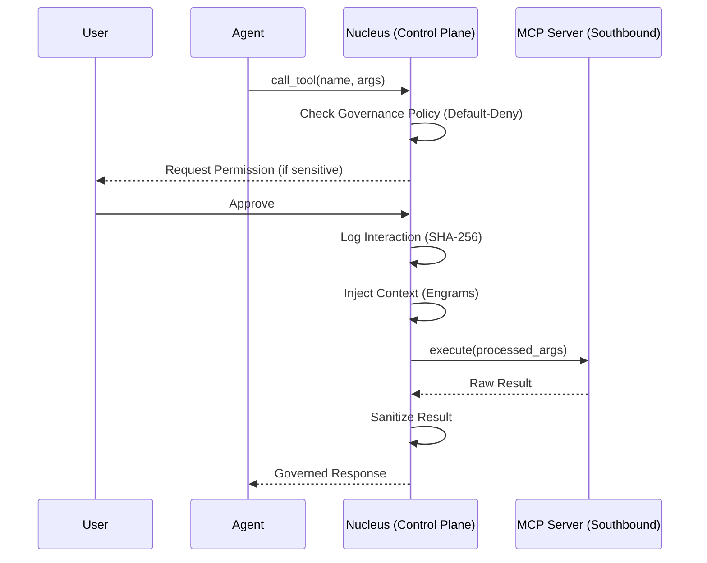

# Architecture Spec: The Recursive Aggregator
*Status: TECHNICAL DRAFT | Category: Agent Control Plane / Host-Runtime*

## 1. Context
Current AI agents use fragmented MCP servers. Each server requires an independent socket/command, leading to "Connection Sprawl" and zero shared context. Nucleus resolves this by acting as a **Host-Runtime** that wraps multiple downward tools into a single upward **Server Interface**.

## 2. High-Level Diagram

## 3. The "Recursive" Pattern
Nucleus is recursive because it implements the **MCP Spec** on both sides of its runtime:
*   **Northbound (Client-Facing)**: Nucleus implements `list_tools`, `call_tool`, and `list_resources` to satisfy the Client's request.
*   **Southbound (Tool-Facing)**: Nucleus implements an **MCP Host** that can run and manage other MCP servers.

## 4. Governance Policies
The Aggregator enforces three primary policies that standalone servers cannot:
1.  **Isolation Boundary**: Mounted servers never receive the upstream `auth_token`.
2.  **Context Injection**: Nucleus can inject project-specific context (Engrams) into any tool call, regardless of the tool's native capabilities.
3.  **Audited Execution**: Every Southbound call is logged in the `interaction_log.jsonl` BEFORE execution.

## 5. Implementation Status

| Feature | Status | Version | Notes |
|---------|--------|---------|-------|
| **Local Plugin Aggregation** | ✅ LIVE | v0.5.0 | Drop `.py` files into `.brain/tools/` |
| **Governance Middleware** | ✅ LIVE | v0.5.0 | Default-Deny, Isolation, Audit Trail |
| **Cryptographic Audit Log** | ✅ LIVE | v0.5.1 | SHA-256 hashed interaction log |
| **Recursive MCP Mounting** | 🔄 PLANNED | v0.6.0 | Mount external MCP servers (npx/docker) |

### What's Live Now (v0.5.x)
- **110+ Native Tools**: Full orchestration, memory, and session management
- **Sideloading**: Any Python file in `.brain/tools/` becomes a live tool
- **Event Ledger**: Immutable `events.jsonl` with full decision audit
- **Interaction Log**: Cryptographic hashes for trust verification (`brain_audit_log()`)

### Coming in v0.6.0
- **Recursive Mounting**: Mount external MCP servers through Nucleus
- **Cross-Server Context**: Inject Engrams into any mounted server's calls
- **Policy Enforcement**: Apply Default-Deny to external servers

## 6. Tool Call Sequence (The Control Flow)

