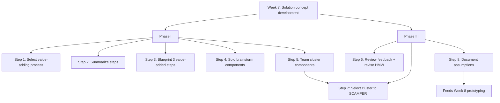
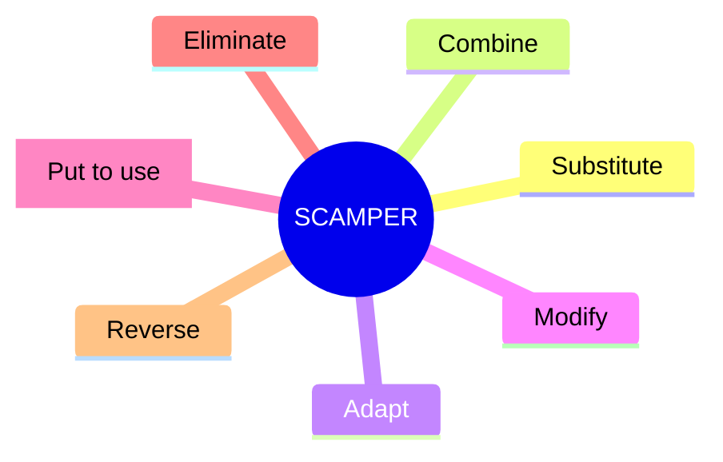
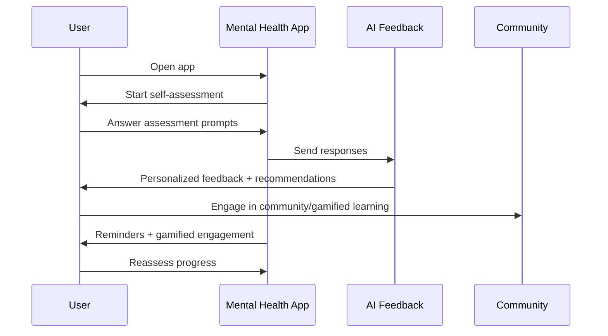

# IIP Miro Export — Mermaid Context (derived)

This document is a **Mermaid-first structural visualization** derived from the course Miro export PDF.

- Source of truth: `docs/iip_reference/raw/M6W12-D2-IIP-Miro-Export.pdf`
- Companion doc: `docs/iip_reference/derived/IIP_MIRO_CONTEXT_TEXT.md`

## How to use (for Cursor/agents)

- Use diagrams to understand *relationships and flow*.
- For exact wording/templates, use the clean text doc.

---

## Week 7 flow (high-level)



## SCAMPER (Week 7 Step 7)



---

## Week 8 flow (prototype + experimentation)

```mermaid
flowchart TD
  W8[Week 8: Storyboard + experimentation plan]

  W8 --> P1[Phase I: Plan prototype]
  P1 --> S1[Step 1: Purpose + scope]
  P1 --> S2[Step 2: Testable hypotheses (2-3)]
  P1 --> S3[Step 3: Goals of testing]
  P1 --> S4[Step 4: Establish details]
  S4 --> D1[People]
  S4 --> D2[Objects]
  S4 --> D3[Location]
  S4 --> D4[Interactions]
  P1 --> S5[Step 5: Sample panel]
  P1 --> S6[Step 6: Rough draft storyboard]

  W8 --> P3[Phase III: Exportable milestone]
  P3 --> S7[Step 7: Storyboard context]
  P3 --> S8[Step 8: Storyboard]
  P3 --> S9[Step 9: Qual feedback plan]
  P3 --> S10[Step 10: Quant feedback plan]

  S2 --> S9
  S2 --> S10
```

## Example storyboard interaction (from PDF narrative)



---

## Week 9 flow (Customer Value Proposition)

```mermaid
flowchart TD
  W9[Week 9: Customer Value Proposition]

  W9 --> S1[Step 1: Define organization]
  S1 --> ID[Corporate identity: strategy/culture/brand]
  S1 --> Path[Choose innovation pathway]

  W9 --> S2[Step 2: Turn novel solution into complete product/service]
  S2 --> UserReq[Start from user requirements]
  S2 --> CustJTBD[Identify paying customer + JTBD]
  S2 --> Stake[Consider stakeholders (buyers/users/etc.)]

  W9 --> S3[Step 3: Craft CVP]
  S3 --> CP[Customer Profile: context, JTBD, pains, gains]
  S3 --> VM[Value Map: pain relievers, gain creators, product/service]
  S3 --> Fit[Assess fit + iterate]

  W9 --> S4[Step 4: Document assumptions]
  S4 --> Pivot[User-centered -> customer-centered pivot]

  S4 --> W10[Feeds Week 10: Business model canvas]
```

---

## TBD / future diagrams

- Add diagrams for other weeks/diamonds once those sections are extracted and stabilized.
- Add a compact “Double Diamond across weeks” map if the PDF includes a canonical week-to-diamond mapping.
