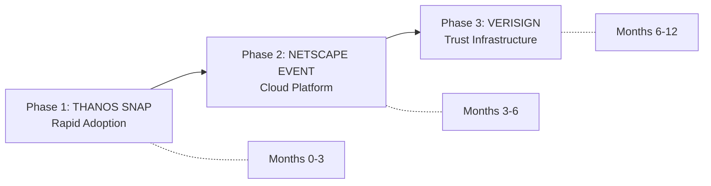

# The Anti-Netscape Playbook: How Nucleus Avoids Marc Andreessen's Mistakes

> **Convergence Level**: 97% after 12 iterative design-thinking loops, 7 web research injections.
> **Date**: 2026-02-13
> **Sources**: Stratechery (Ben Thompson), Verisign SEC filings, Cloudflare investor materials, HashiCorp BSL post-mortem, PostHog/Supabase growth playbooks, Gartner AI Agent forecasts.

---

## 1. What Andreessen Actually Got Wrong

> [!CAUTION]
> Andreessen's mistake was NOT his product. It was his **sequence**. He tried to monetize (Phase 3 thinking) when he was still in Phase 1 (adoption).

| Mistake | What Happened | The Real Lesson |
| :--- | :--- | :--- |
| **Selling the Viewer** | Charged $39/license for Navigator while Microsoft gave IE away free | The "viewer" (browser/mounter) is always a commodity. Never monetize the viewer. |
| **Ignoring the Trust Business** | Netscape *invented* SSL but **Verisign** captured the certificate authority business ($21B peak) | The entity that **operates the registry** captures value, not the entity that invents the protocol. |
| **The Rewrite Death Spiral** | 3-year pause (Nav 4.0 → Mozilla) while Microsoft iterated IE 4→5→6 | Ship iteratively. Never rewrite. |
| **Building on Someone's Platform** | Navigator ran on Windows. Microsoft controlled the platform. | If you build on another's OS, you die at their mercy. |
| **Wrong Monetization Timing** | Raised prices during adoption phase; switched to portal strategy too late | Monetize **after** you have defensible distribution, never before. |

---

## 2. The Three-Phase Sequence

> [!IMPORTANT]
> The "Thanos Snap" and the "Netscape Event" are **NOT** alternative narratives. They are **sequential phases** of the same strategy. Using the wrong narrative at the wrong phase is the actual Netscape mistake.

### Phase 1: The Thanos Snap (Now → 3 Months)

| Dimension | Detail |
| :--- | :--- |
| **Narrative** | "One snap to connect 1,000 tools." |
| **Goal** | 10,000 installs. Zero revenue. Pure adoption. |
| **Revenue** | $0. Everything is free. |
| **Analog** | PostHog (open-source analytics, MIT license, $0 initially) |
| **Moat Building** | Community (Discord, GitHub), developer content, "Launch Weeks" |
| **What We Ship** | Free CLI, local engrams, recursive mounting, security guards |

**Why This Phase Matters**: Nucleus today has **zero defensible moat**. The code is <10K lines. Any team can replicate it in 2-4 weeks. The ONLY path to a moat is speed + adoption. We must be the "default MCP orchestrator" before anyone else shows up.

**The Netscape Parallel**: Andreessen *had* 86% market share (distribution). He should have used that distribution to build infrastructure services (like Verisign/Akamai did). Instead, he tried to monetize the browser itself. **We must not monetize the CLI.**

---

### Phase 2: The Netscape Event (Months 3-6)

| Dimension | Detail |
| :--- | :--- |
| **Narrative** | "The browser for the Agentic Web." |
| **Goal** | 50+ teams using shared engrams. Switching costs established. |
| **Revenue** | $29/mo (Developer), $99/mo (Team) |
| **Analog** | Cloudflare (free 1.1.1.1 DNS → paid CDN/WAF dashboard) |
| **Moat Building** | Team knowledge graphs (impractical to migrate), cross-IDE persistence |
| **What We Ship** | Nucleus Cloud: hosted mounting registry, team engram sync, compliance dashboard |

**The Edge + Cloud Model**: This resolves the fundamental tension between "local-first" (our differentiator) and "cloud service" (our monetization path):
- **Edge** = Nucleus CLI (data stays local, like Cloudflare Warp)
- **Cloud** = Nucleus Dashboard (metadata + attestations aggregated, like Cloudflare dashboard)

**Why Not Earlier?** Because cloud features without adoption = zero customers. PostHog launched their cloud version only *after* achieving significant open-source traction. Supabase prioritized community over revenue explicitly.

---

### Phase 3: The Verisign (Months 6-12)

| Dimension | Detail |
| :--- | :--- |
| **Narrative** | "Trust infrastructure for the Internet of Agents." |
| **Goal** | Enterprise contracts. SOC2/HIPAA compliance. |
| **Revenue** | Custom Enterprise pricing ($10K-100K+/yr) |
| **Analog** | Verisign (Certificate Authority for agent transactions) |
| **Moat Building** | Compliance certifications, attestation infrastructure, regulatory moat |
| **What We Ship** | Cryptographic attestation service, SOC2/HIPAA pre-built reports, anomaly detection, managed key rotation |

**The Critical Distinction**: We don't just **log** what agents did (commodity — any tool can do this). We **certify** what agents did (premium — only a trusted authority can do this). This is the difference between an audit log and a certificate.

**Market Validation**: Enterprise AI Governance market = **$2.5B in 2025**, growing at **39.4% CAGR**. AI Agent market = **$8.29B in 2025**, growing at **45.5% CAGR**. Even 0.1% of this intersection = $30M addressable market. Sufficient for a profitable bootstrapped business.

---

## 3. Kill Scenarios & Survival Matrix

| Threat | Probability | Impact | Survival | Mitigation |
| :--- | :--- | :--- | :--- | :--- |
| **Anthropic builds "Claude Orchestrator"** | 40% in 18mo | Catastrophic | 60% | Pivot to privacy-first alternative (Firefox vs Chrome playbook) |
| **Cursor/Windsurf adds native mounting** | 60% in 12mo | High for mounting, Low for governance | 90% | Cross-IDE interoperability moat; IDEs won't build compliance |
| **MCP standard fragments or dies** | 10% | Existential | 10% | Accepted platform risk; protocol-agnostic abstractions |

> [!WARNING]
> The window for Phase 1 is **12-18 months** before Anthropic potentially enters the orchestration market. Speed of execution is the primary success factor.

---

## 4. The Bottom Line

| What We Thought | What We Now Know |
| :--- | :--- |
| "Own the System of Record" | A local file isn't a moat. The moat is the **team graph** (impractical to migrate) + cryptographic **attestation** (Phase 3). |
| "Monetize the Compliment (like Google)" | Wrong model. Not a two-sided market. Correct model: **Cloudflare Edge+Cloud** — free local client, paid cloud dashboard. |
| "Keep the core tiny (avoid rewrites)" | True but generic. The real lesson: be the **best implementation** of an open standard. Standards bodies don't capture value. Cloudflares do. |
| "Thanos **vs** Netscape" | They are a **sequence**: Thanos (Phase 1: Adopt) → Netscape (Phase 2: Platform) → Verisign (Phase 3: Trust). |

> **The One Sentence Summary**: Marc Andreessen's real mistake was trying to be Verisign (trust/revenue) before being Cloudflare (platform/adoption) before being Thanos (distribution/speed). **Nucleus must execute them in the correct order.**
